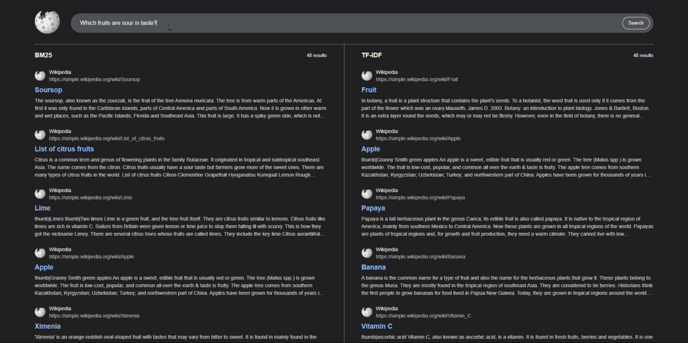

# Wikipedia Search Engine

## Overview

A mini search engine built on the **Simple Wikipedia** dump (\~239,000
articles).\
This project implements a full Information Retrieval pipeline including:

-   Inverted Index construction
-   TF-IDF ranking
-   BM25 ranking 
-   Document length normalization
-   Semantic re-ranking
-   Web-based frontend interface

The goal of this project was to understand how real-world search engines
work internally, from indexing to ranking and retrieval.

**Note:** This project does not use any sort of crawlers. The data required was sources from wikimedia dumps. You can access the same dataset from here: https://dumps.wikimedia.org/simplewiki/latest/simplewiki-latest-pages-articles-multistream.xml.bz2





## Tech stack:

-   **Backend:** Python
-   **Frontend:** React.js
-   **Database:** SQLite

------------------------------------------------------------------------

## Dataset

-   Source: Wikipedia
-   https://dumps.wikimedia.org/simplewiki/latest/simplewiki-latest-pages-articles-multistream.xml.bz2
-   \~239,000 articles
-   \~355MB compressed

------------------------------------------------------------------------


## How It Works

### 1. Offline Indexing

-   Parse Wikipedia dump into a csv format.
-   Tokenize articles
-   Remove stopwords
-   Apply stemming
-   Build inverted index:

```
    term → { document_id: term_frequency }
```

-   Compute:
    -   Total document count
    -   Document frequency per term
    -   IDF values
    -   Document length per article
    -   Average document length (for BM25)

All index structures are serialized and stored for fast query-time
loading.

------------------------------------------------------------------------

### 2. Query Processing

When a user enters a query:

-   Normalize text
-   Tokenize
-   Remove stopwords
-   Apply stemming
-   Retrieve posting lists from inverted index

------------------------------------------------------------------------

### 3. Ranking Algorithms

#### First-Stage Ranking

In this project, I am using 2 different approaches for First-Stage Ranking
1. TF-IDF
2. BM25

#### Re-ranking

After retrieving top-k results from BM25, semantic-comparison between the query, title, and text of the article is computed.

NOTE: The semantic re-ranker is only applied to the BM25 results. 

------------------------------------------------------------------------

### 4. Metadata Retrieval

Final results are fetched from SQLite:

-   Title
-   Snippet
-   URL

Returned results are displayed in the frontend interface.

------------------------------------------------------------------------

## Backend Setup (Python)

Navigate to backend:

``` bash
cd Backend
```

Create virtual environment:

``` bash
python -m venv .venv
```

Activate:

Mac/Linux:

``` bash
source .venv/bin/activate
```

Windows:

``` bash
.venv\Scripts\activate
```

Install dependencies:

``` bash
pip install -r requirements.txt
```

Run backend:

``` bash
python main.py
```


------------------------------------------------------------------------

## Frontend Setup (pnpm)

Navigate to frontend:

``` bash
cd Frontend
```

Install dependencies:

``` bash
pnpm install
```

Run development server:

``` bash
pnpm run dev
```

------------------------------------------------------------------------

## Example Queries

-   Which fruits are sour in taste?
-   Apple
-   Who is Donald Trump?

------------------------------------------------------------------------

## Key Concepts Implemented

-   Inverted Index
-   TF-IDF Ranking
-   BM25 Ranking
-   Two-stage Retrieval
-   Semantic Re-ranking

------------------------------------------------------------------------

## Future Improvements

-   Phrase matching
-   Proximity scoring
-   Query classification
-   Better semantic ranking
-   Index compression
-   Adding a crawler

------------------------------------------------------------------------

## Demo

<video src="./Video.mp4" controls="controls" width="100%" height="400">
</video>

------------------------------------------------------------------------

## Motivation

Search engines are one of the most fundamental systems in computer
science.\
This project was built to deeply understand:

-   How documents are indexed
-   How ranking algorithms affect relevance
-   Why BM25 replaced TF-IDF in most production systems
-   How multi-stage ranking pipelines work

------------------------------------------------------------------------

<iframe src="https://www.linkedin.com/embed/feed/update/urn:li:ugcPost:7429828930125230080" height="1928" width="504" frameborder="0" allowfullscreen="" title="Embedded post"></iframe>

## License

Article content sourced from Wikipedia and licensed under CC BY-SA 4.0.
